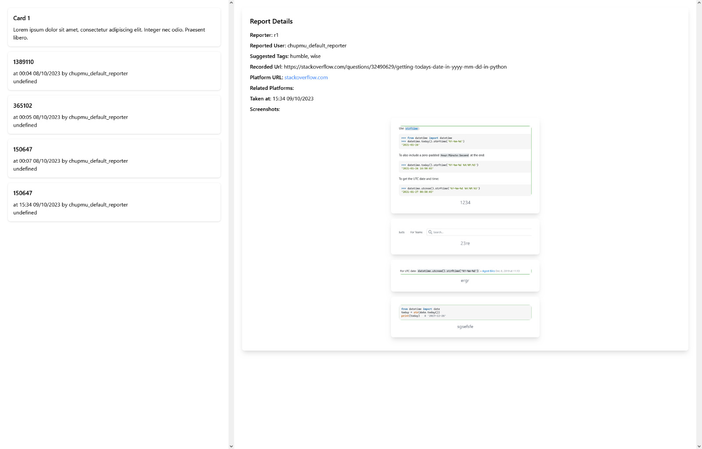

## Themabeschreibung: Entwicklung einer Webanwendung zur Anzeige von Benutzerberichten über Websites

In diesem Projekt wird eine Webanwendung entwickelt, die es Benutzern ermöglicht, Berichte über Websites zu erstellen und anzuzeigen. Die Benutzer haben die Möglichkeit, eine oder mehrere Datenbanken für ihre Berichte zu den Websites zu erstellen und zu verwalten.

#### Autor: Thi Ngan Ha Pham
### Funktionen:

- **Benutzerberichte erstellen:** Die Benutzer können Berichte zu verschiedenen Websites verfassen. Diese Berichte können Text und Bilder enthalten.

- **Datenbankverwaltung:** Die Benutzer haben die Möglichkeit, ihre Berichte in einer Datenbank zu verwalten, um sie strukturiert zu speichern.

- **Berichtsbewertung und Nominierung:** Die Benutzer und Viewer können die Berichte bewerten und Benutzer nominieren, die besonders objektive und qualitativ hochwertige Berichte verfassen.

### Komponenten:

#### Frontend:
Das Frontend der Webanwendung zeigt die Benutzerberichte an. Dabei werden Text und Bilder aus den Berichten dargestellt. Außerdem ermöglicht das Frontend das Abgeben von Bewertungen (Voting) für die Berichte durch die Viewer.

#### Backend:
Das Backend der Anwendung empfängt Daten von den Benutzern, speichert die Berichte in den Datenbanken und überträgt die Berichte an das Frontend. Es verwaltet auch die Bewertungen und Nominierungen der Benutzer und Viewer.

Dieses Projekt zielt darauf ab, eine interaktive Plattform zu schaffen, auf der Benutzer Berichte über Websites teilen, bewerten und anerkennen können. Die Entwicklung umfasst sowohl die Benutzeroberfläche als auch die Datenverwaltung, um ein reibungsloses Erlebnis für alle Benutzer sicherzustellen.

#### Demo:

Das Website wird beispielweise so aussehen:

 